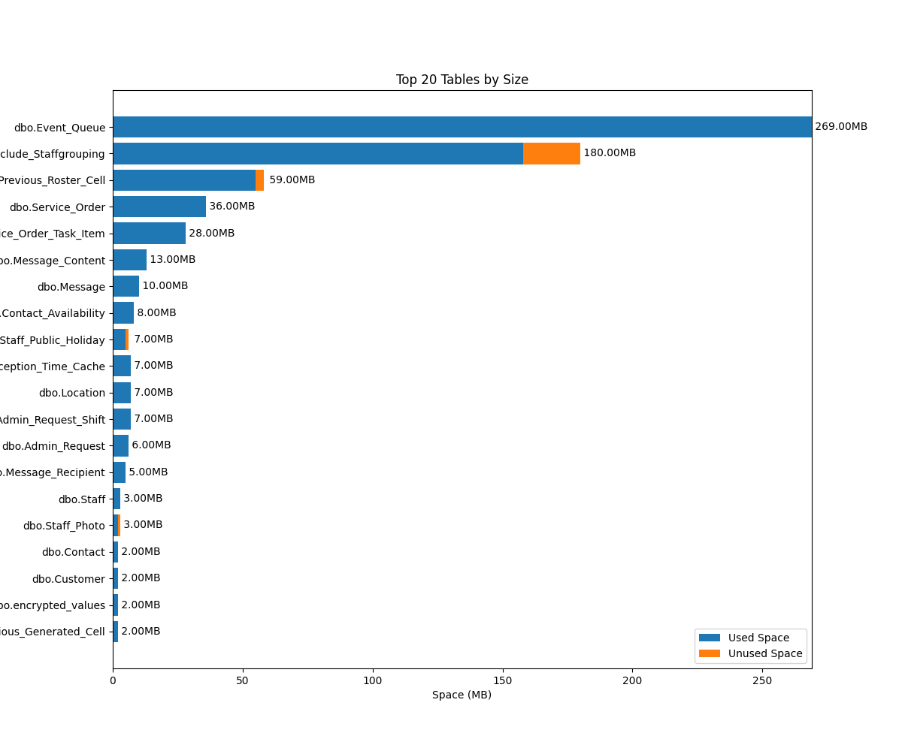

# Database Performance Analysis

Contains SQL and Python scripts to analyze the performance of a database.

## Project Structure

    ```
    ├── README.md
    ├── Solution-Problem-1.sql  # SQL script for Problem 1
    ├── Solution-Problem-2.py   # Python script for Problem 2
    ├── requirements.txt        # Python dependencies
    ```

## Usage

### Problem 1

- Run the SQL script `Solution-Problem-1.sql` in database.

### Problem 2

1. Install the dependencies

   ```bash
   pip install -r requirements.txt
   ```

2. Run the Python script `Solution-Problem-2.py`.

   ```bash
   python Solution-Problem-2.py
   ```

3. Authenticate with Microsoft Entra ID

## Example output

- Problem 2.1: 
- Problem 2.2: [Output_2.2-non_standard_tables.txt](../output/Output_2.2-non_standard_tables.txt)
- Problem 2.3: [Output_2.3-query_counts](../output/Output_2.3-query_counts.txt)

### Feelfree to contribute to this project by following the [Contribution Guidelines](CONTRIBUTING.md).
