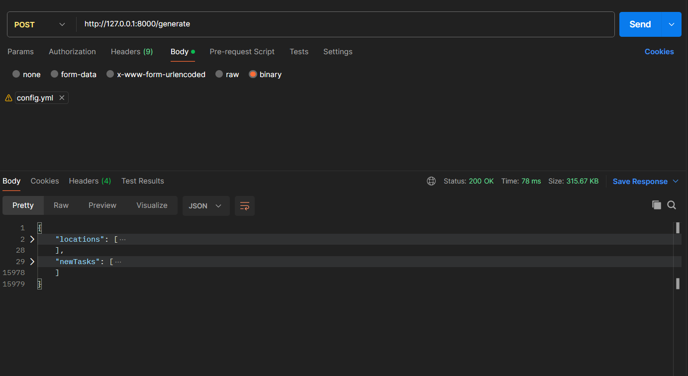
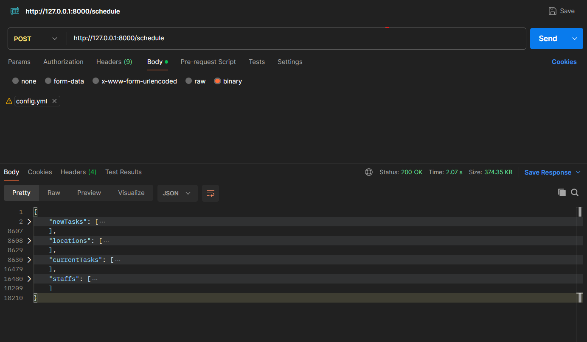

# Data Generation for Task Scheduling

This project handles the generation of data for task scheduling using FastAPI.

## Table of Contents

- [Spin up the project](#spin-up-the-project)
- [Sample](#sample)
- [API Endpoints](#api-endpoints)
- [Running Tests](#running-tests)
- [Project Structure](#project-structure)
- [Note](#note)
- [Improvements](#improvements)

## Spin up the project

1. Clone the repository:

   ```sh
   git clone <repository-url>
   cd WFO-DE/TaskSchedule
   ```

2. Without Docker:

   Create a virtual environment

   ```sh
   python -m venv venv
   source venv/bin/activate  # On Windows use `venv\Scripts\activate`
   ```

   Install the dependencies:

   ```sh
   pip install -r requirements.txt
   ```

   Start the FastAPI server:

   ```sh
   fastapi run app/main.py --port 8000
   ```

3. With Docker

   Build the Docker image:

   ```sh
    docker build -t taskschedule .
   ```

   Run the Docker container:

   ```sh
   docker run -d -p 8000:8000 taskschedule
   ```

## Sample

Update the [`config.yml`] file with the necessary configuration settings.

1. Generate data for tasks and locations(Problem 1):

   - With curl:

   ```sh
   curl -L 'http://127.0.0.1:8000/generate' -H 'Content-Type: text/yaml' --data-binary '@/C:/Path_To_File/config.yml' -o Output.json
   ```

   - With Postman:
     

2. Generate data for tasks, locations, staff, and schedule them(Problem 2):

   - With curl:

   ```sh
   curl -L 'http://127.0.0.1:8000/schedule' -H 'Content-Type: text/yaml' --data-binary '@/C:/Path_To_File/config.yml' -o Output.json
   ```

   - With Postman:
     

## API Endpoints

- `POST /generate`: Problem 1 - Generates task and location data based on the configuration.
- `POST /schedule`: Problem 2 - Generates task, location, staff, and current task data based on the configuration.

## Project Structure

- [`app/`]: Contains the main application code.
  - [`main.py`]: Entry point for the FastAPI application.
  - [`model/`]: Contains data models.
  - `services/`: Contains service classes like [`DataGenerator`] and `TaskScheduler`.
  - [`utils/`]: Contains utility functions and logger configuration.
- [`tests/`]: Contains unit tests for the application.
- [`config.yml`]: Configuration file.
- [`Dockerfile`]: Docker configuration for containerizing the application.
- [`requirements.txt`]: Python dependencies.

## Running Tests

Run the following command to execute the tests:

```sh
python -m unittest discover tests
```

## Note

- Staff always being available each day of start_end_date. So, the staff will not have any day off.
- Each task will be executed within one day of the start_end date

## Improvements

- Find `best Staff` for each task to optimize scheduling. E.g., assign the staff closest to the location, ...
- Enhance the logging mechanism for better debugging.
